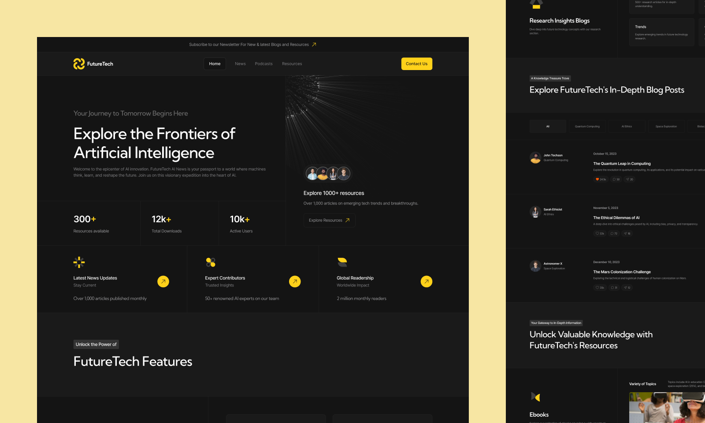

# 🤖 FutureTech

Эстетичный, ультрабыстрый и технологичный многостраничный портал (MPA), посвященный главной и самой злободневной теме современности — Искусственному Интеллекту. Проект рассказывает о будущем технологий, которые (возможно) когда-нибудь заберут у нас работу... но точно не сегодня! 😎

Сайт разработан как демонстрация продвинутой инженерной культуры и кастомной модульной архитектуры без перегрузки клиентского интерфейса лишними фреймворками.



---

## 🛠 Мой Стек и Инструменты

### 🏗 Архитектура и Сборка
* **Astro & Islands Architecture** — инновационный фреймворк, который по умолчанию полностью вырезает клиентский JavaScript. Интерактивные элементы работают как изолированные «острова», что гарантирует максимальную скорость загрузки страниц.
* **Clean Architecture** — строгое разделение проекта на независимые слои (UI-компоненты, секции, лейауты) и изоляция бизнес-логики от среды окружения.
* **TypeScript** — строгая типизация пропсов (`interface Props`) в компонентах для обеспечения безопасности данных и автодополнения в IDE.

### 🎨 Стили, Адаптив и Архитектура
* **Sass (SCSS) + БЭМ** — модульная, независимая структура стилей. Каждый блок инкапсулирован, легко масштабируется и не создает глобальных конфликтов.
* **CSS3 (Flexbox & Grid Layouts)** — сложные футуристичные сетки, разработанные с идеальным выравниванием контента.
* **Adaptive & Responsive Design** — комбинация стратегий Mobile/Desktop-First. Интерфейс безупречно подстраивается под любые экраны: от смартфонов до широкоформатных мониторов.

### 🧠 Логика (JavaScript)
* **JavaScript (ES6+) & OOP** — клиентская логика написана в объектно-ориентированном стиле.
* **DOM API, Модули и Замыкания** — чистый, легковесный JS-код для оживления «островов» интерфейса (например, мобильного меню) без использования тяжелых SPA-библиотек.

### 🤖 Автоматизация и Качество кода
* **Линтеры и форматирование:** ESLint, Stylelint, Prettier для поддержания идеального порядка в коде.
* **Проверка перед коммитом:** Автоматические Git-хуки через **Husky + Lint-staged** (код валидируется до фиксации изменений).
* **История изменений:** Commitlint (строгий контроль семантики и стандартов сообщений коммитов).
* **Процесс разработки:** GitHub Flow.

### 📐 Дизайн и UX/UI
* **Figma** — точнейшая разработка интерфейса по макету с соблюдением сетки и визуальной иерархии.
* **UI/UX basics** — детальная проработка интерактивных состояний элементов (`hover`, `active`, `focus`) для кнопок, карточек и ссылок в темной теме.
* **Web Accessibility (a11y) & SEO** — семантичная HTML5 разметка и базовые требования доступности для поисковых роботов и пользователей.

---

## 📂 Архитектурная структура проекта (Сlean Layout)

Проект использует строгое разделение ответственности, где импорты движутся исключительно сверху вниз:

```text
src/
├── assets/           # Медиаресурсы (оптимизированные картинки, шрифты)
├── components/       # Переиспользуемые БЭМ-компоненты и UI-атомы
├── layouts/          # Глобальные оболочки (каркас сайта)
├── pages/            # Роутинг и страницы (входные точки)
├── scripts/          # Модульная ООП-логика на чистом JS (классы)
├── sections/         # Крупные смысловые блоки и секции страниц
└── styles/           # Глобальная архитектура стилей (SCSS)
